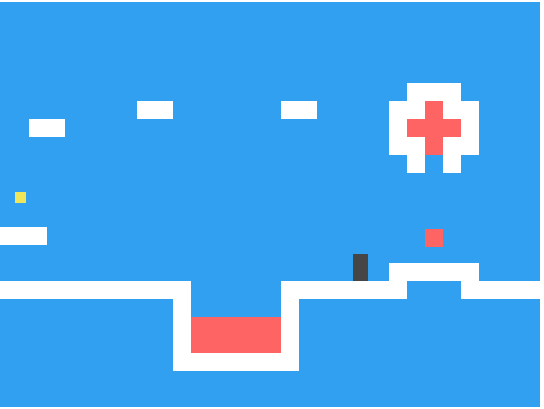
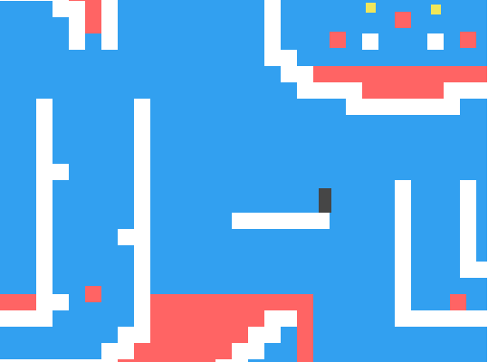

# JavaScript Game

Proyecto del curso **"JavaScript desde cero"** realizado en *KeepCoding*.

Se creará un juego tipo *Mario Bross* desde cero.

## Capturas
Detalle primer nivel

Detalle segundo nivel
